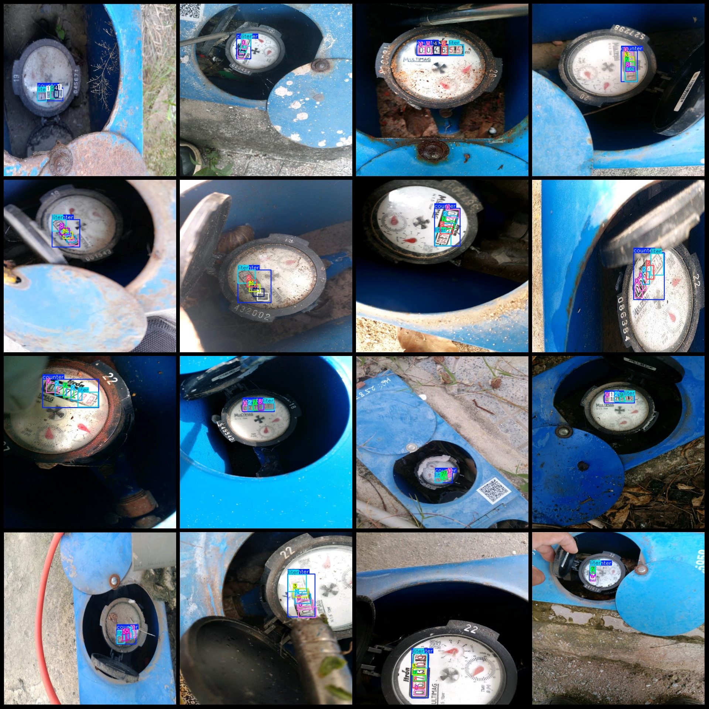
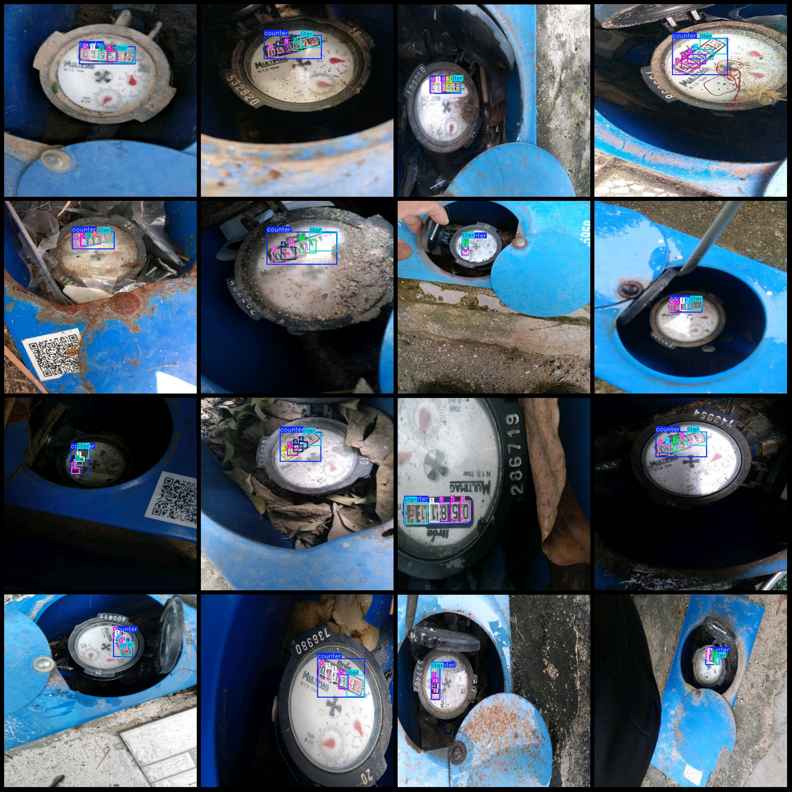

# Water Meter Reading Data Set VOC+YOLO Format with 3552 Images in 12 Classes with Rotation Augmentation

Note: The dataset contains many enhanced images, mainly rotation-enhanced images.

Dataset format: Pascal VOC format + YOLO format (txt file without split path, only containing jpeg images and corresponding VOC format xml files and yolo format txt files).
Number of images (jpg file count): 3552
Number of annotations (xml file count): 3552
Number of annotations (txt file count): 3552
Number of annotation categories: 12
Annotation category names (notice that the order of categories in the yolo format is not consistent with this, but refer to the labels folder's classes.txt for consistency): ["0","1","2","3","4","5","6","7","8","9","counter","liter"]
Number of bounding boxes per category:
0 Bounding box count = 3865
1 Bounding box count = 1768
2 Bounding box count = 1390
3 Bounding box count = 1295
4 Bounding box count = 1198
5 Bounding box count = 1074
6 Bounding box count = 1019
7 Bounding box count = 827
8 Bounding box count = 908
9 Bounding box count = 864
counter Bounding box count = 3552
liter Bounding box count = 3551
Total bounding box count: 21311
Image resolution: 640x640
Using labelImg for annotation
Annotation rules: Draw a square around the category
Important note: No special statement currently exists
Special declaration: This dataset does not guarantee the accuracy of the trained model or weight files
Image previews:

## Images

Here is a pay link on Stripe ( https://buy.stripe.com/3cs8yP7sY87d0vu9AB ). Please contact me lonlonago@foxmail.com after funding $89, and I will send you a complete data files , thank you!

